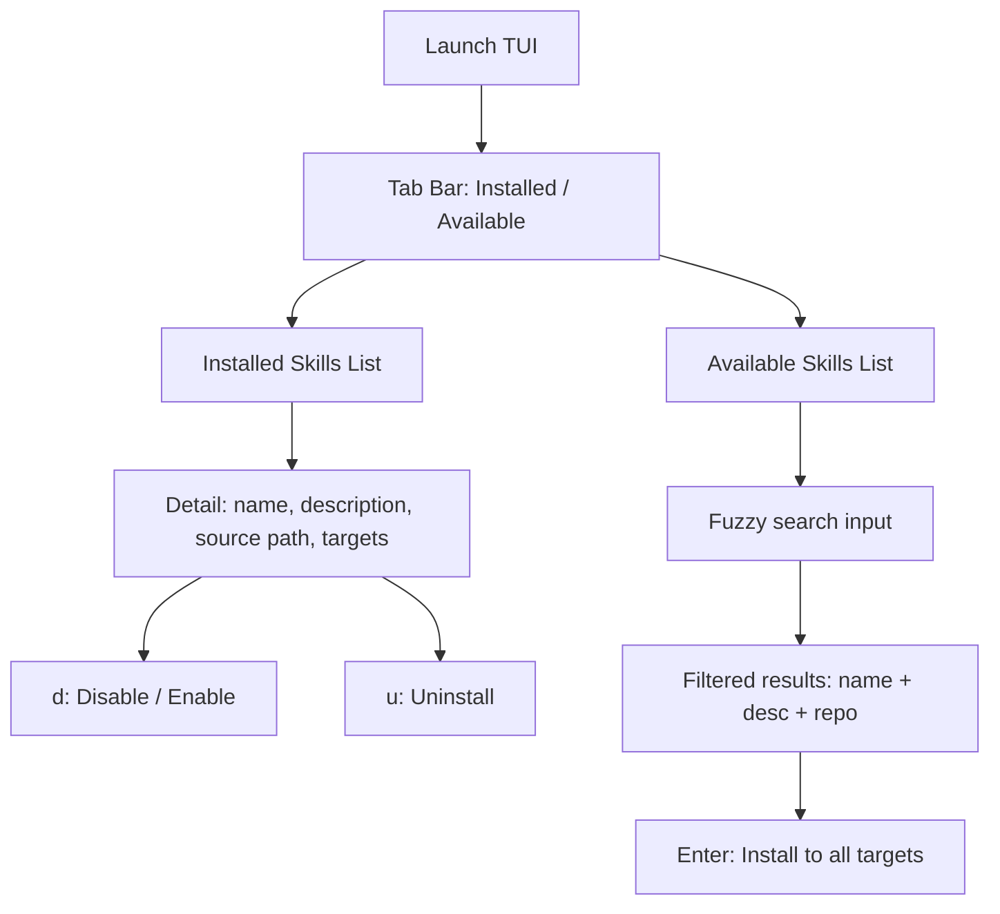

# Skills Manager TUI Spike

## What we're building

A terminal UI (OpenTUI + Bun + TypeScript) with two views:

1. **Installed skills** -- list with disable/enable, uninstall, and info actions
2. **Available skills** -- fuzzy-searchable list (name + description + source repo) with install action

All installs use **symlinks only**. Config lives at `~/.config/skills-manager/config.yaml`.

## UI Flow




## Architecture


**Three modules:**

- **Scanner** (`src/scanner.ts`) -- Recursively finds all `SKILL.md` files in source dirs, parses frontmatter (name, description), records source repo. Also scans target dirs for installed skills.
- **Actions** (`src/actions.ts`) -- Install (symlink to all 3 targets), uninstall (remove symlinks), disable (move symlink to `.disabled/`), enable (move back).
- **TUI** (`src/ui.ts` + `src/index.ts`) -- OpenTUI views wired to scanner data and actions.

## Config file: `~/.config/skills-manager/config.yaml`

```yaml
sources:
  - name: personal
    path: ~/Projects/skills/.cursor/skills
  - name: kitchen
    path: ~/Projects/skills-kitchen
    recursive: true

targets:
  - ~/.cursor/skills
  - ~/.codex/skills
  - ~/.claude/skills
```

- `recursive: true` means scan all subdirectories for `SKILL.md` (needed for skills-kitchen where repos have varying structures).
- Default `recursive: false` means only scan `path/*/SKILL.md` (one level deep, like your personal repo).

## Key decisions

- **OpenTUI core** (imperative API, no React/Solid) -- simplest for a spike, fewer deps
- **Fuzzy search** via `fuse.js` on skill name + description
- **Symlinks only** -- `ln -s source target` for install, `rm` for uninstall
- **Disable convention** -- move symlink from `~/.cursor/skills/foo` to `~/.cursor/skills/.disabled/foo` (mirrors existing `.disabled/` directory)
- **No git, no registry, no remote** -- purely local sources for now

## Dependencies

- `@opentui/core` -- TUI framework
- `gray-matter` -- YAML frontmatter parsing
- `fuse.js` -- fuzzy search

## Key behaviors

- On launch: scan all sources and targets, build index
- Installed view shows: skill name, source path (where symlink points), which targets have it
- Available view shows: skill name, description (from frontmatter), source repo name
- Install creates symlinks in all 3 target dirs
- If a skill is already installed (symlink exists), it shows in Installed, not Available
- Uninstall removes symlinks from all 3 targets
- Disable/enable moves symlinks to/from `.disabled/` in each target

## File structure

```
skills-problem/
  src/
    index.ts        -- entry point, wires everything together
    scanner.ts      -- find and parse SKILL.md files
    actions.ts      -- install, uninstall, disable, enable
    ui.ts           -- OpenTUI views and navigation
    config.ts       -- load and resolve config
    types.ts        -- Skill, Source, Config types
  package.json
  tsconfig.json
```

