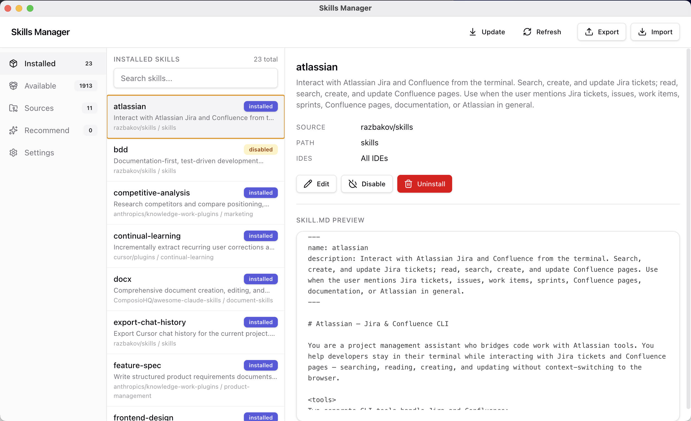

# Skills Manager

A management layer for AI agent skills — discover, install, scope, rate, and update skills across Cursor, Codex, and Claude Code.

All three tools follow the open [Agent Skills](https://agentskills.io/) standard (`SKILL.md`), but none solves the management problem: how to find the right skill, avoid duplicates, track where it came from, or know if it's any good.

## Usage

- One-line setup: `curl -fsSL https://raw.githubusercontent.com/razbakov/skills-manager/main/scripts/install.sh | bash`
- `skills` launches the desktop Electron UI after setup.
- `skills ui` also launches the desktop Electron UI.
- `bun run electron` launches the desktop Electron UI.
- `skills --export-installed [output-path]` exports installed skills to JSON.
- `skills --import-installed [input-path]` imports skills from `skills.json` format.
- `skills import [input-path]` is shorthand for import.
- In the **Installed** tab, press `e` to export installed skills to `installed-skills.json` in the current working directory.
- Exported entries include only install metadata (repository URL + optional skill path), not local filesystem paths.
- On first run, if no config exists, `skills` auto-creates one and preloads currently available local sources.

## Desktop UI

Electron desktop interface (`skills ui`) with Installed, Available, and Sources tabs:

## Problem

See **[Research](docs/research.md)** for how tools handle skills today, **[User Problems](docs/problems.md)** for 14 documented pain points, **[Landscape](docs/landscape.md)** for existing directories and tools, and **[Competitors](docs/competitors.md)** for detailed analysis of current solutions and their gaps.

- **Naming collisions** — Multiple skills share similar names or overlap in responsibility. Cursor has no detection; Codex shows both without merging; Claude Code overrides by scope precedence.
- **No development workflow** — No way to test, enable, or disable skills without editing files by hand (Codex has `config.toml`, but no UI).
- **Unknown provenance** — None of the three tools track where a skill came from, who wrote it, or how to update it.
- **Scattered collections** — Skills live in 3–6 different directories per tool with no unified view.
- **No quality signals** — No ratings, benchmarks, or reviews exist anywhere in the ecosystem.

## Key Features

- **[Skill Registry](docs/registry.md)**: Search, browse, and install skills from a shared catalog with deduplication and conflict detection.
- **[Scope Management](docs/scopes.md)**: Enable or disable skills at three levels — personal, organization, and project — with clear precedence rules across all supported tools.
- **[Provenance Tracking](docs/provenance.md)**: Every skill records its source repo, author, version, and update channel.
- **[Quality Scores](docs/quality.md)**: Community and automated ratings for security, efficiency, and best practices, with benchmarks across models and harnesses.
- **[Development Mode](docs/dev-mode.md)**: GUI for authoring, testing, and previewing skills before publishing.
